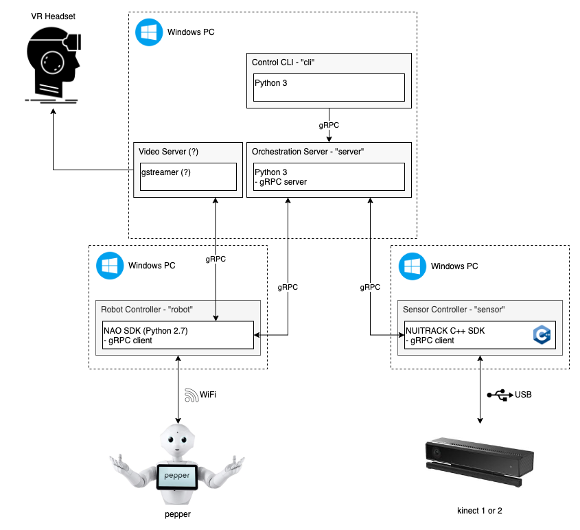

# Pepper Teleoperation Thesis Project

## Overview

Honours thesis project at QUT. Setting up the Pepper Robot from Softbank robotics to be teleoperated by a coach for wellbeing sessions.

**NOTE:** A Licence is required to run this code for every different camera used.

## Architecture

[draw.io diagram](https://drive.google.com/file/d/15wpGS0--yn8Fi1c7cR0pJ2L11V6-p2VH/view?usp=sharing)

| Component | Description                                                                                       |
| --------- | ------------------------------------------------------------------------------------------------- |
| server    | Python gRPC server to facilitate network communications between all components                    |
| robot     | Python program to operate Pepper, gRPC client; handles robot commands and video + audio streaming |
| sensor    | C++ program to harvest data from the Kinect sensor, gRPC client                                   |
| cli       | Python program to conveniently control the system, gRPC client                                    |

## Setup & Install Dependencies

[Conda](https://docs.conda.io/projects/conda/en/latest/user-guide/install/index.html)

## Useful Links / Docs

[gRPC - Python Quick Start](https://grpc.io/docs/languages/python/quickstart/)
[gRPC - Performance Best Practices](https://grpc.io/docs/guides/performance/)
